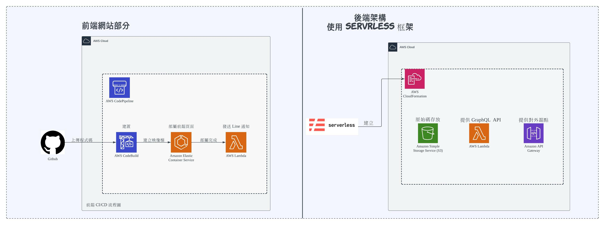

# Ubro-graphql  

## 簡單介紹
一個簡單的 `GraphQL API` ，資料庫使用 `MySQL`  
提供給集點卡系統使用  
因為內容是要給 `AWS Lambda` 用，所以有關 `apollo-server` 的都是使用 `lambda` 的，如果要在 host 上使用的話需要做修改
前端部分可參考儲存庫內 [ubro](https://github.com/RayLin9981/ubro) 是使用 `vue.js` 開發  

## 部署
使用 `serverless` 框架來部署   
provider 使用 AWS  

